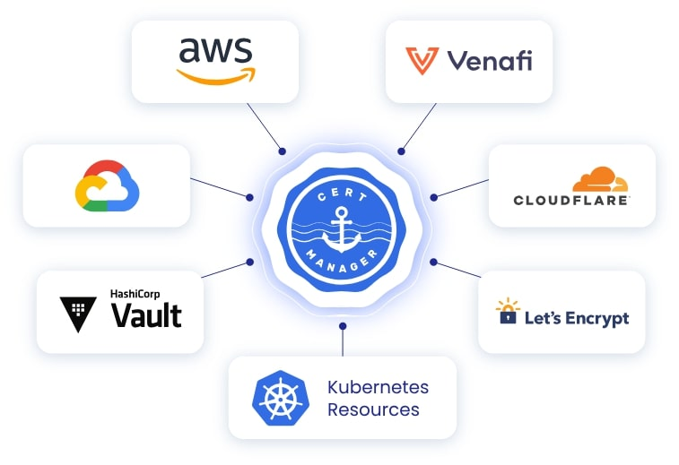
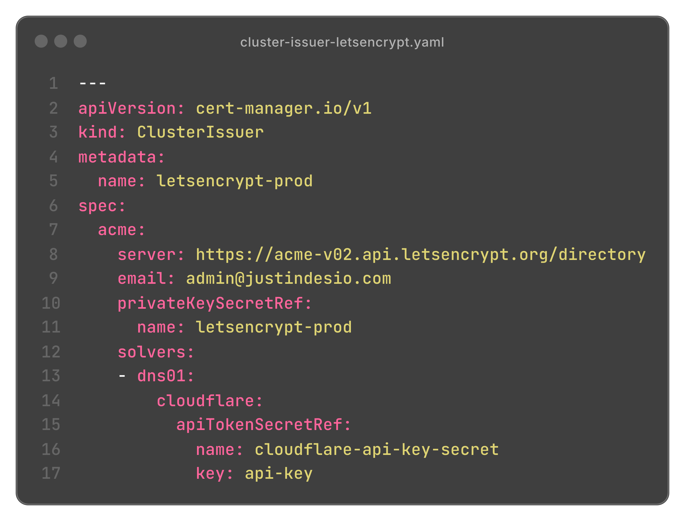
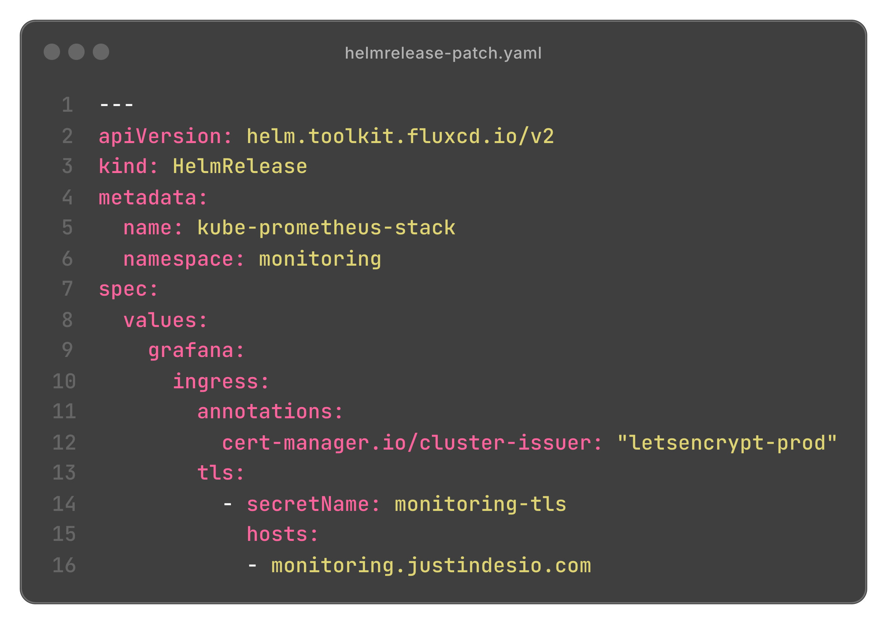
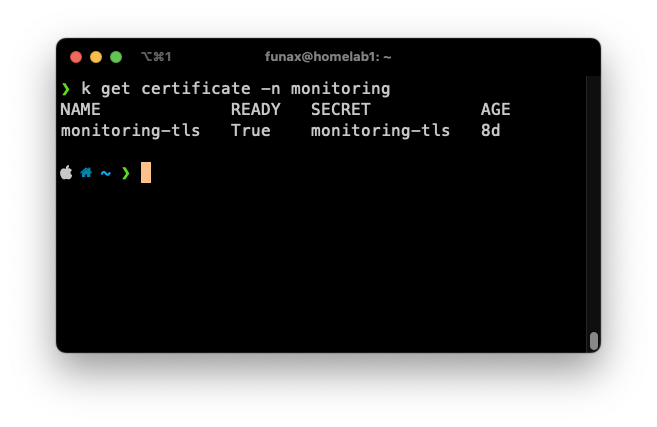

Today, securing communications on the Internet is no longer an option, it's an obligation. TLS certificates are at the heart of this security: they encrypt exchanges, enable HTTPS (the little padlock that browsers love), authenticate services, and establish a real chain of trust, whether on the Internet or even on local networks if you use an internal CA.

But let's be honest: manually generating, installing, and renewing these certificates is a pain. It's repetitive, prone to oversight, and can screw up a production service if the cert expires without warning. And no, a cronjob with `openssl` doesn't count as a certificate management strategy.

Fortunately, we don't need to go through paid certificate authorities. Let's Encrypt offers free TLS certificates via the ACME protocol, and it covers the vast majority of dev, personal, or even professional needs. It's simple, effective, and integrated into tons of tools.

One of these tools is **Certbot**, an ACME client that does the job: it verifies that you actually own the domain (via HTTP or DNS challenges), requests the certificate, installs it, and renews it automatically. For a classic web server on VM or bare-metal, frankly, it's perfect.

But as soon as you move to a **Kubernetes cluster**, the story changes. Imagine managing dozens or hundreds of Ingress, each with their domains, their certs, their expiration dates... There, Certbot no longer keeps up:  
- No native integration with Kubernetes resources  
- No automatic synchronization with Secrets  
- No declarative control over certificate lifecycle management  
- Not scalable without custom scripts or unstable hacks

This is where **cert-manager** comes into play, and it literally changes the game.

---

## Why cert-manager is the right solution on Kubernetes

cert-manager is a **Kubernetes controller** that handles the entire TLS certificate lifecycle, through Custom Resource Definitions (CRDs) like `Certificate`, `Issuer`, or `ClusterIssuer`. It integrates perfectly with Kubernetes' declarative model, allowing you to manage certificates like any other cluster resource.

In practice, you declare a `Certificate` object, link it to an `Issuer` (often Let's Encrypt), expose your Ingress, and cert-manager takes care of the rest. The ACME challenge (HTTP-01 or DNS-01) is handled automatically, the certificate is stored in a `Secret`, and it's renewed before expiration — **without manual intervention**.

But what makes cert-manager truly powerful is its ability to **adapt to cluster complexity** while maintaining a simple declarative approach:

- You can generate a **wildcard certificate** to cover all subdomains of a namespace or environment.
- You can create **multi-domain certificates** with multiple SANs if you want to consolidate.
- You choose your isolation level: a local `Issuer` per namespace to keep control, or a global `ClusterIssuer` if you prefer to centralize (simplest case).

Result: whether you have 10 or 500 Ingress, cert-manager allows you to manage your certificates in a **flexible, automated way aligned with GitOps best practices**.  
You define everything in your YAML manifests, version your certs like the rest of your infrastructure, and forget about rotation problems: cert-manager handles them for you, cleanly and on time.

---

## How I used cert-manager in my cluster

In my case, I mainly needed TLS certificates for my internal services, accessible only locally. For services exposed on the Internet, I use Cloudflare Tunnel, which already provides a certificate on the Cloudflare side. So I don't need to manage TLS in the cluster for those.

To generate my certificates via Let's Encrypt, there were two options: the HTTP-01 challenge and the DNS-01 challenge. The HTTP-01 challenge requires serving a specific endpoint (`/.well-known/acme-challenge/`) in HTTP on a publicly accessible port. Since my internal services are not directly exposed, this challenge is not applicable in my case.

So I chose DNS-01. This challenge works by publishing a TXT record in the domain's DNS zone. Since my domain is managed at Cloudflare, I was able to connect cert-manager to their API so everything is done automatically. 
Once the DNS solver is configured, cert-manager takes care of everything: it creates the records, validates the challenge, generates the certificate, stores it in a Kubernetes Secret, and renews it before expiration. I don't have to do anything anymore.

---

###  Automatic TLS certificate acquisition with cert-manager and DNS-01

sequenceDiagram
    participant CM as cert-manager (Controller)
    participant CF as Cloudflare (DNS API)
    participant LE as Let's Encrypt (ACME)
    participant SEC as TLS Secret (Kubernetes)
    participant ING as Ingress Controller (Traefik)

    CM->>CF: Creates TXT record 
    LE->>CF: Verifies DNS record
    LE-->>CM: Validation successful + certificate sent
    CM->>SEC: Stores certificate
    ING->>SEC: Mounts certificate


---

### ClusterIssuer configuration with Cloudflare solver

This `ClusterIssuer` resource allows cert-manager to generate certificates at the cluster level by relying on Let's Encrypt. It uses the DNS-01 challenge with the Cloudflare API to validate domain ownership.

---

### TLS certificate deployment for monitoring service

Here, I use Helm to deploy the `kube-prometheus-stack`. The Ingress is annotated to tell cert-manager to use my previously defined `ClusterIssuer` (`letsencrypt-prod`). The certificate will be stored in the `monitoring-tls` Secret, which is then automatically used by the Ingress to enable HTTPS.

---

### Verification of the generated certificate

Once in place, I can verify that the certificate has been properly issued and stored via `kubectl`. The certificate is valid, active, and will be automatically renewed before its expiration.

