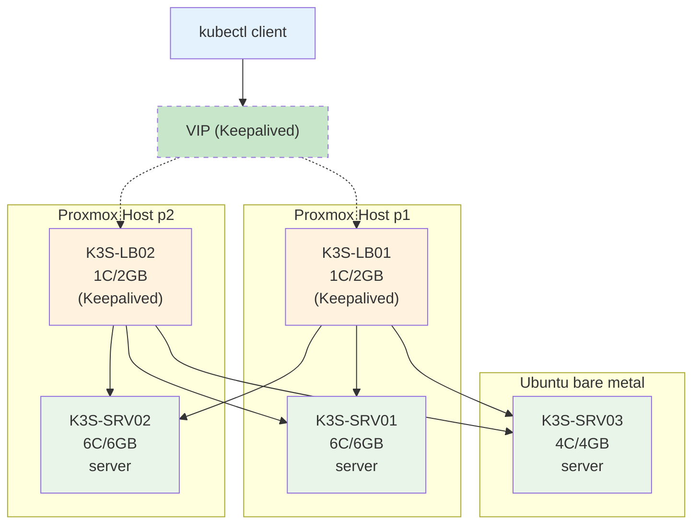

title: "Comment je suis passé de 20% à 98% de disponibilité avec un serveur instable"
summary: ""
categories: ["Post", "Blog"]
date: 2025-10-04
draft: false
repo: "https://github.com/justin-de-sio/homelab"
---

# Comment je suis passé de 20 % à 98 % de disponibilité dans mon cluster K3s

Pendant longtemps, mon homelab tournait sur **un seul serveur DIY**.
Un petit setup, simple et efficace : un **nœud unique K3s**, une base SQLite, quelques pods… pas tres puissant mais suffisant pour apprendre les bases.

Mais j’avais envie d’aller plus loin.
Je voulais **expérimenter la haute disponibilité**, les concepts de scheduling, peemtion, evcition, répartir la charge et gagner en **puissance de calcul**.
Alors je suis passé à un **cluster K3s multi-nœuds**.

C’est là que les vrais problèmes ont commencé.

---

## 1. Du mono-node au cluster distribué

Au départ, mon homelab se composait d’un **serveur unique**.
Je gérais tout sur une seule machine, sans réplication, sans tolérance de panne.
Ensuite, j’ai ajouté **deux mini PC** pour créer un cluster K3s avec **trois nœuds** :
deux nœuds sur le premier mini PC, et un sur le second.

Le but était simple : apprendre à gérer un cluster distribué avec **etcd**, **Traefik**, et **Longhorn**.
Mais très vite, j’ai découvert la limite du matériel grand public :
le **premier mini PC** avait une **défaillance de carte réseau**.

Ce problème rendait mon cluster **extrêmement instable**.
Le nœud principal tombait régulièrement, et je devais **débrancher puis rebrancher le câble RJ45** pour rétablir la connexion.
Autant dire que c’était tout sauf de la haute disponibilité.

---

## 2. Un cluster à moitié vivant

Concrètement, lorsque la carte réseau du mini PC défaillant plantait,
les nœuds hébergés dessus devenaient injoignables.
Résultat :

* des **pods inaccessibles**,
* des **volumes Longhorn dégradés**,
* une **API Kubernetes inaccessible**, 
** des applications complètement hors ligne**


---

## 3. Première tentative : changer l’endpoint du control-plane

Ma première réaction a été de changer l’**endpoint du control-plane** vers une machine plus stable.
Ça a un peu aidé : je pouvais de nouveau accéder à l’API K3s.

Il fallait une solution plus robuste, capable de **distribuer le trafic** et de **survivre à une panne réseau**.

## Problème d'Ingress
Un autre problème venait de la façon dont j’accédais à mes applications.
À ce moment-là, je n’avais pas encore de load balancer ni d’ingress stable devant le cluster.
J’exposais mes services directement via les adresses IP des nœuds, et je faisais pointer mes enregistrements CNAME DNS dessus (par exemple app.mondomaine.fr → 192.168.1.12).

Mais comme la carte réseau de mon premier serveur avait des défaillances, je perdais régulièrement la connectivité avec lui.
Et comme plusieurs pods tournaient sur ce nœud, dès qu’il tombait, ils étaient déplacés automatiquement sur un autre.
Le problème, c’est que l’adresse IP changeait à chaque fois.

Résultat : le DNS continuait de pointer vers le premier serveur, celui qui ne répondait plus.
Les requêtes arrivaient donc sur le mauvais nœud, et l’application semblait “down”, alors qu’elle tournait très bien ailleurs dans le cluster.

La seule solution que j’avais à ce moment-là, c’était de modifier manuellement le CNAME DNS pour le faire pointer vers le nouveau nœud actif.
C’était fastidieux et contraire à l’idée même de la haute disponibilité.
C’est là que j’ai compris qu’il me fallait un point d’entrée unique et stable, capable de rediriger automatiquement le trafic HTTP vers les bons nœuds, même si le premier serveur perd la connexion.
C’est exactement ce que j’ai résolu ensuite avec HAProxy et Keepalived.

---

## 4. Le vrai tournant : mettre en place du Load Balancing HA

### Étape 1 — Ajouter HAProxy sur chaque mini PC

J’ai installé **un HAProxy sur chaque hôte Proxmox**, chacun capable de distribuer le trafic vers les trois nœuds K3s.
Chaque HAProxy surveille l’état des nœuds et retire automatiquement ceux qui ne répondent plus.

```haproxy
frontend https_in
  bind *:443
  mode tcp
  default_backend traefik_nodes

backend traefik_nodes
  mode tcp
  balance roundrobin
  option tcp-check
  default-server fall 2 rise 2 inter 2000
  server k3s-1 192.168.1.103:443 check
  server k3s-2 192.168.1.104:443 check
  server k3s-3 192.168.1.105:443 check
```

Ainsi, même si un nœud devient injoignable, le trafic est immédiatement redirigé vers les autres.
Et si c’est le mini PC défaillant qui tombe, l’autre continue à servir les requêtes sans interruption.

---

### Étape 2 — Supprimer le SPOF du Load Balancer

Un seul HAProxy, c’est déjà mieux.
Mais s’il tombe, c’est encore un **Signle point of failure**.
J’ai donc ajouté **Keepalived** pour créer une **adresse IP virtuelle (VIP)** partagée entre les deux HAProxy.
En cas de panne d’un hôte, l’autre récupère automatiquement l’adresse.

```conf
vrrp_instance VI_1 {
  state BACKUP
  interface eth0
  virtual_router_id 51
  priority 100
  advert_int 1
  authentication {
    auth_type PASS
    auth_pass secret
  }
  virtual_ipaddress {
    192.168.1.8/24 dev eth0
  }
}
```

Résultat :

* Une seule **adresse IP stable** (192.168.1.8) pour accéder au cluster.
* Si un mini PC ou une carte réseau tombe, le trafic bascule automatiquement sur l’autre.
* Le cluster reste **disponible et réactif**, même pendant une panne physique.

---

### Schéma d’architecture



---

## 5. Protéger les données : Longhorn et CNPG

Une fois la partie réseau stabilisée, il fallait encore garantir que **les données restent disponibles**, même pendant une panne.

Avec **Longhorn**, j’ai mis en place une réplication sur **trois nœuds**.
Chaque volume est copié sur plusieurs hôtes, ce qui permet de continuer à lire et écrire même si un nœud disparaît.
Les réplicas se reconstruisent automatiquement dès que le nœud revient.

Pour la base de données, j’utilise **CloudNativePG**, avec une instance PostgreSQL par nœud.
Un **failover automatique** se déclenche si le nœud principal tombe. Ainsi, les applications ne perdent jamais leur base, même en cas de panne réseau.

---

## 6. Scheduling intelligent

Il reste pas mal de chose a faire niveau scheduling et healcheck.

## 7. Les résultats

Depuis que j’ai ajouté HAProxy, Keepalived, Longhorn et CNPG :

* Mon cluster reste **accessible même quand un nœud tombe**.
* Les données restent **disponibles et cohérentes**.
* Je n’ai plus besoin de **toucher à l'ip de mon cluster**.
* Et ma disponibilité est passée de **20 % à environ 98 %**.

Aujourd’hui, je peux casser, tester, redéployer sans craindre qu’une panne réseau ruine tout le cluster. 

---

## 9. Et maintenant ?

Je prévois de :

* **Remplacer la carte réseau défectueuse** du premier mini PC par une 10G/bits et ne le transformer en firewall/routeur.
* Récupéré d'autre mini pc afin d'avoir au moins 3 noeud physique.
* Tester le **chaos engineering** (pannes réseau simulées).
* Continuer à améliorer la **tolérance aux pannes** et la **répartition de charge**.
