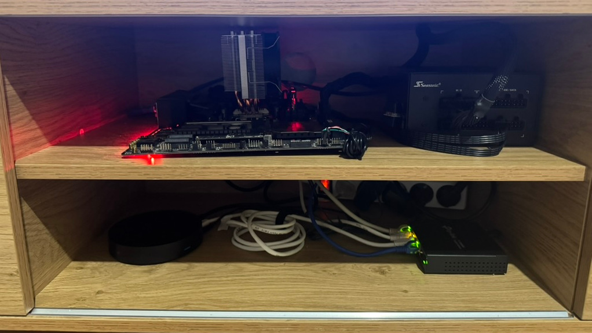

Ça faisait un moment que je voulais faire un homelab pour realisé des projets.
 J'avais des vieux composants qui traînaient, alors je me suis dit : pourquoi pas les recycler et me monter un petit serveur à la maison ?”
L'idée, c'est d'y faire tourner un petit cluster Kubernetes avec quelques apps auto-hébergées, dans une approche DevSecOps et GitOps.  
Je vais gérer mes déploiements avec **Flux CD** et **Helm**, histoire d'automatiser tout ça proprement dès le début.

## Spécifications  
- **Processeur :** Intel i5-7600K 4.2GHz, 4 cœurs  
- **Mémoire :** 8 Go de RAM DDR4  
- **Stockage :** 500 Go en SSD NVMe  
- **Réseau :** 1 Gbit/s

## Setup  
  
Oui, c’est bien un serveur coincé dans une étagère télé.  
Oui, ça chauffe un peu.  
Est-ce que c’est aux normes ? Absolument pas.  
Est-ce que c’est dangereux ? Probablement.  
Est-ce que je suis fier ? Carrément. 🔥😎

## Retour d’expérience  
Sur ce homelab, j'ai installé Ubuntu et K3s.  
Au début, j'avais testé Talos Linux, mais j'ai trouvé ça trop restrictif et abstrait pour apprendre.  
Ma stack actuelle me permet d'avancer vite tout en gardant un max de flexibilité.

J'ai déjà appris qu'il vaut parfois mieux **commencer simple** plutôt que de se lancer direct sur des solutions trop spécialisées comme Talos.  
Tout dépend de l'objectif : **prod solide** ou **apprentissage pratique**.
