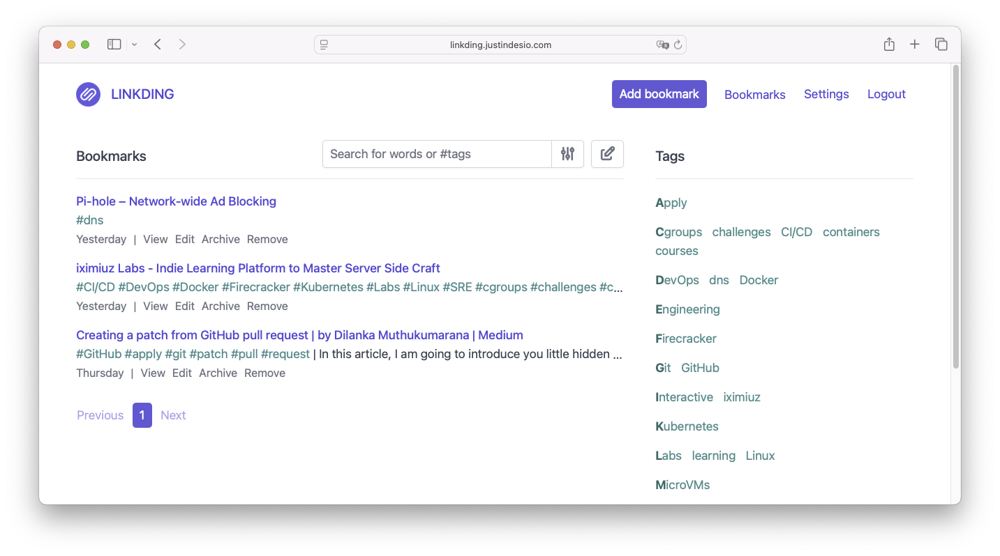
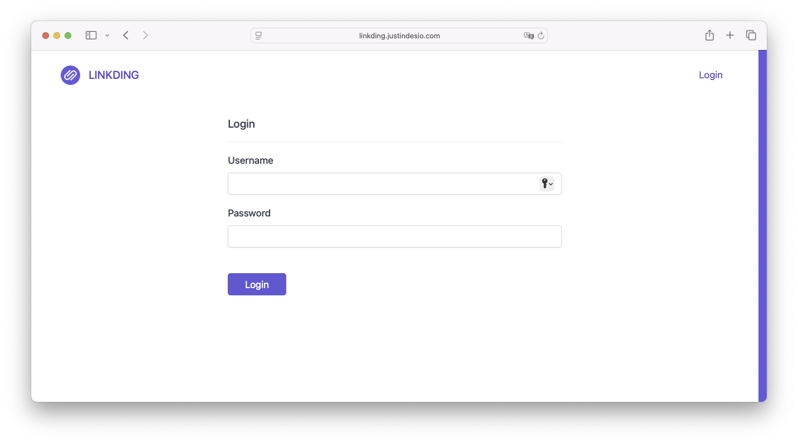

---
title: "Production-Ready Deployment of My Homelab’s First App via GitOps"
summary: "How I deployed Linkding on a single-node K3s homelab using FluxCD, SOPS/Age and Cloudflare Tunnel."
categories: ["Homelab"]
tags: ["homelab","kubernetes","gitops","linkding","cloudflare-tunnel","sops"]
date: 2025-05-04
draft: false
---

This article highlights how I deployed **Linkding**, my self-hosted bookmarking service, on a single-node K3s homelab with a GitOps mindset. No full tutorial here—just the key decisions, snippets and diagrams that show *what* I built and *why* it matters.




*Missed my K3s mono-node setup? Read “[Homelab Adventures: The Beginning]()”.*

---

## FluxCD GitOps Initialization

Managing Kubernetes declaratively with GitOps means **every** change goes through Git, is reviewed, audited and automatically applied to the cluster by Flux.

### Why GitOps?

- **Versioned changes** – every manifest change is in Git history.  
- **Collaboration** – use pull requests to review infra.  
- **Security** – no direct `kubectl apply`, secrets stay encrypted.  
- **Automation** – Flux reconciles on every push, handles rollbacks.

### Repository Layout

I follow Flux’s “base + overlays” pattern:

```text
justin-de-sio-homelab/
├── apps/
│   ├── base/
│   │   └── linkding/
│   └── staging/
│       └── linkding/
└── clusters/
    └── homelab/
````

* **apps/base/linkding/**: core resources shared across environments (Namespace, Deployment, Service, PVC).
* **apps/staging/linkding/**: staging-specific manifests (Cloudflare Tunnel, encrypted secrets).
* **clusters/homelab/**: Flux Kustomization pointing at `apps/staging`.

### GitOps Workflow


flowchart LR
Dev\[Developer] -->|git push| GH\[GitHub Repo]
GH --> Flux\[Flux v2]
Flux --> K3s\[K3s Cluster]
K3s --> Linkding\[Linkding Pod]


---

## Linkding Deployment Highlights

Instead of pasting every YAML file, here are the core design choices:

```yaml
# apps/base/linkding/deployment.yaml (excerpt)
apiVersion: apps/v1
kind: Deployment
metadata:
  name: linkding
spec:
  template:
    spec:
      securityContext:
        runAsUser: 33    # non-root user
        fsGroup: 33
      containers:
      - name: linkding
        image: sissbruecker/linkding:1.39.1
        ports:
        - containerPort: 9090
        resources:
          requests:
            cpu: "250m"
            memory: "640Mi"
          limits:
            cpu: "500m"
            memory: "1280Mi"
        envFrom:
        - secretRef: { name: linkding-credentials }
```

* **Non-root execution** improves security posture.
* **Resource requests/limits** ensure Linkding remains stable alongside other workloads.

The Service remains `ClusterIP` until we add external exposure:

```yaml
# apps/base/linkding/service.yaml
apiVersion: v1
kind: Service
metadata:
  name: linkding
spec:
  type: ClusterIP
  selector: { app: linkding }
  ports:
  - port: 9090
    targetPort: 9090
```

---

## Security & Secret Management

Keeping credentials out of plaintext Git is essential. I use **SOPS + Age**:

```yaml
# .sops.yaml
creation_rules:
  - path_regex: .*.yaml
    encrypted_regex: ^(data|stringData)$
```

Encrypted Secret example:

```yaml
# apps/staging/linkding/secret.yaml (excerpt)
apiVersion: v1
kind: Secret
metadata:
  name: linkding-credentials
  namespace: linkding
data:
  LD_SUPERUSER_NAME: ENC[…]
  LD_SUPERUSER_PASSWORD: ENC[…]
sops:
  age:
    - recipient: age1…YourPublicKey…
```

Flux’s SOPS plugin decrypts on-the-fly during reconciliation—**no** clear-text ever hits Git history.


sequenceDiagram
Developer->>Git: commit encrypted secret.yaml
Flux->>SOPS: decrypt request
SOPS-->>Flux: cleartext manifest
Flux->>K8s: apply Secret


---

## Secure Exposure via Cloudflare Tunnel

Rather than opening ports on my home network, I rely on **Cloudflare Tunnel** (formerly Argo Tunnel) to publish Linkding securely:

- **No inbound firewall holes** – the tunnel initiates an outbound connection from your cluster to Cloudflare’s edge, so you never expose a port on your router.
- **Built-in TLS** – Cloudflare terminates HTTPS at the edge and maintains a **Full (strict)** connection back to your pod.
- **High availability** – run multiple tunnel replicas for redundancy with minimal effort.

<aside>
💡 **How it works**:  
1. A small `cloudflared` agent inside your cluster establishes a persistent connection to Cloudflare.  
2. Cloudflare Edge routes incoming requests for `linkding.justindesio.com` over that tunnel.  
3. Your service remains safely behind NAT—only the encrypted tunnel talks to the outside world.
</aside>

### Key Configuration (conceptual)

```yaml
# Minimal excerpt: tell cloudflared which hostname maps to which service
ingress:
  - hostname: linkding.justindesio.com
    service: http://linkding:9090
  - service: http_status:404
````

### Request Flow


flowchart LR
  Internet -->|TLS| CF[Cloudflare Edge]
  CF -->|Argo Tunnel| CD[cloudflared Pod]
  CD -->|HTTP| Svc[Linkding Service]
  Svc -->|TCP| Pod[Linkding Pod]


1. **Client** → Cloudflare Edge over HTTPS
2. **Edge** → `cloudflared` via the persistent tunnel
3. **cloudflared** → Kubernetes Service → Linkding Pod

This setup keeps your cluster locked down while serving traffic over a trusted, cloud-managed conduit.


## Staging First, Production Later

I start in **staging** before creating a `production/` overlay because:

1. **Safe sandbox**: experiment without touching live traffic
2. **Confidence**: validate all manifests first
3. **Clear separation**: keep WIP changes away from production

Once staging is stable, I’ll clone and adjust for production:

* Increase replicas or add HPA
* Enforce PodSecurity & NetworkPolicies
* Add backup and disaster-recovery routines

---

## Key Takeaways & Next Steps

* **GitOps** provides audit trails and automated rollbacks.
* **Kustomize overlays** keep manifests DRY, modular and composable.
* **SOPS + Age** let you store secrets encrypted in a public repo securely.
* **Cloudflare Tunnel** offers safe, managed ingress without opening firewall holes.

### Coming Soon

In the next article, I’ll dive into **Monitoring & Observability** with **Prometheus**, **Grafana** dashboards and **alerting rules**—complete with YAML you can plug straight into your homelab.

---

**Explore the code**: [github.com/justindesio/homelab](https://github.com/Justin-De-Sio/homelab)
Feel free to clone, experiment, and open issues or PRs. Happy self-hosting! 🚀
