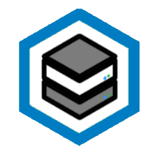

Let me cook.

<table>
    <thead>
        <tr>
            <th>Logo</th>
            <th>Titre</th>
            <th>Description</th>
            <th>Références</th>
        </tr>
    </thead>
    <tbody>
        <tr>
            <td></td>
            <td>
              Homelab
              
                Bientôt disponible
              
            </td>
            <td>Mon homelab où j'exécute mes propres services.</td>
            <td></td>
        </tr>
         <tr>
            <td></td>
            <td>
              Mon site web
              
                Actif
              
            </td>
            <td>Mon site web statique simple, réalisé avec <a target="_blank" href="https://gohugo.io/">Hugo</a> & <a target="_blank" href="https://blowfish.page/">Blowfish</a>.</td>
            <td><a target="_blank" href="https://github.com/justin-de-sio/my-blog">Dépôt Github</a></td>
        </tr>
        <tr>
            <td></td>
            <td>
              JSTAcademy
              
                Archivé
              
            </td>
            <td>
                
JST Academy est une plateforme interactive de formation en ligne proposant des cours structurés avec des leçons et des quiz. Elle utilise des technologies modernes avec <strong>Angular</strong> pour le frontend et <strong>Java Spring Boot</strong> pour le backend.

                
Son infrastructure repose sur deux <strong>pipelines CI/CD</strong> automatisés et gérés via GitLab :

                <ul>
                <li>Le premier pipeline construit les images Docker, exécute les tests d'intégration et déploie sur <strong>AWS EC2</strong> grâce à Ansible.</li>
                <li>Le second pipeline provisionne et gère l'infrastructure cloud sur <strong>AWS EC2</strong> à l'aide de <strong>Terraform</strong>.</li>
                </ul>
            </td>
                <td><a target="_blank" href="https://gitlab.com/jstacademy">Dépôt GitLab</a></td>
        </tr>

</tbody>

</table>
